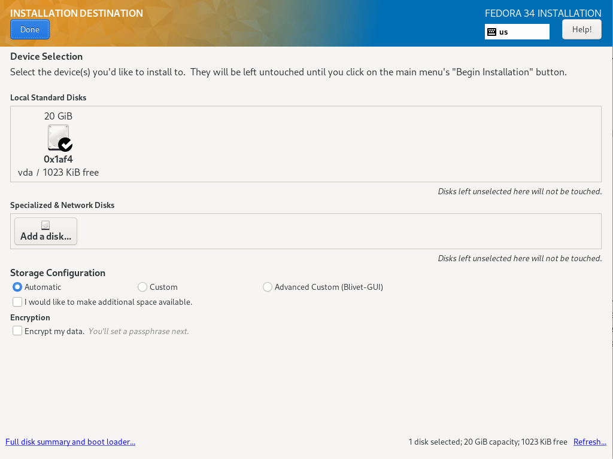
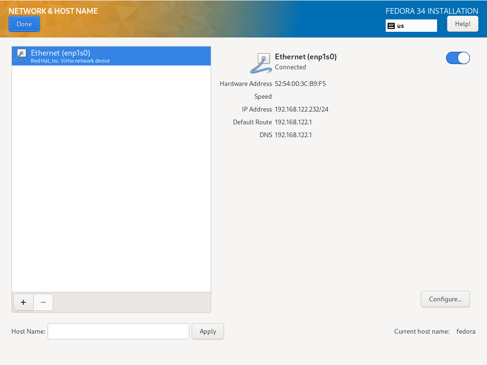
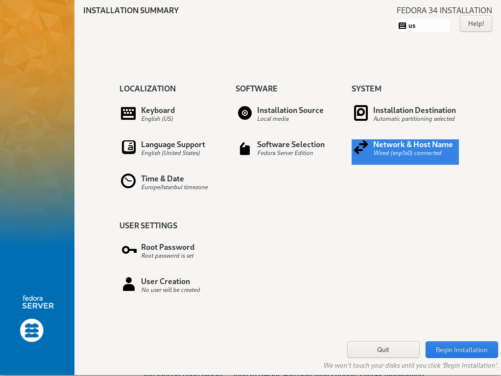
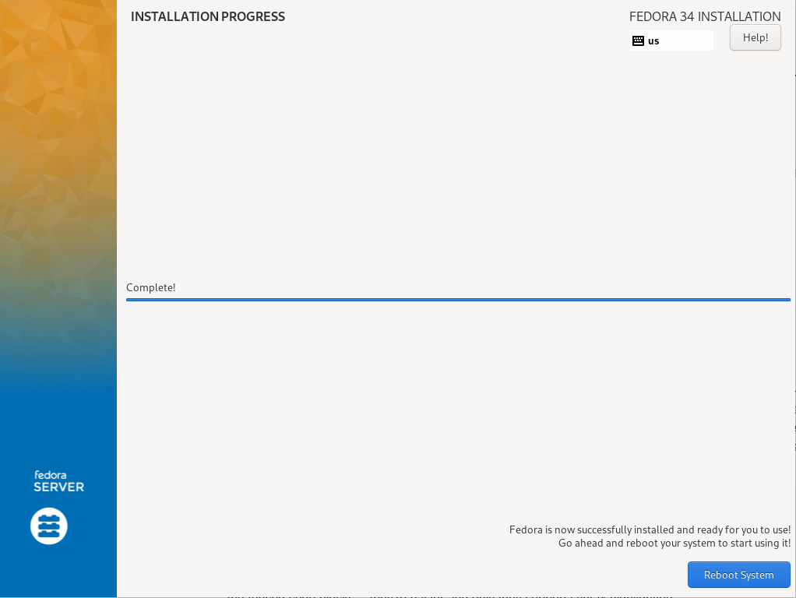
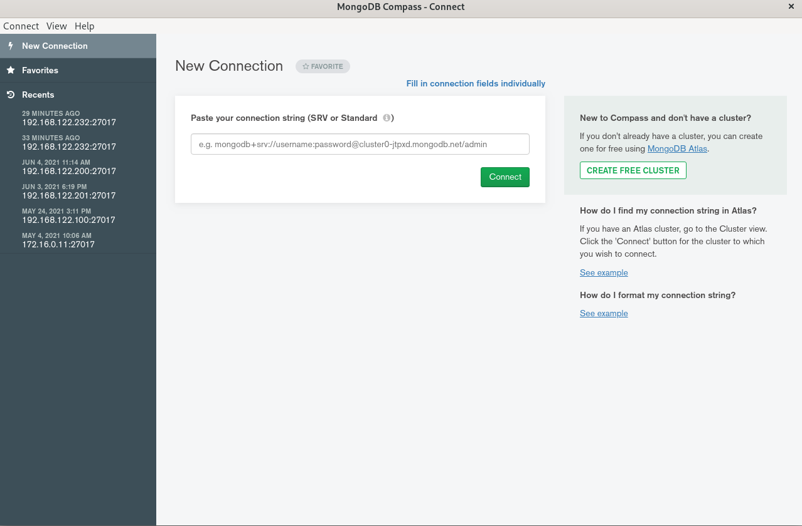
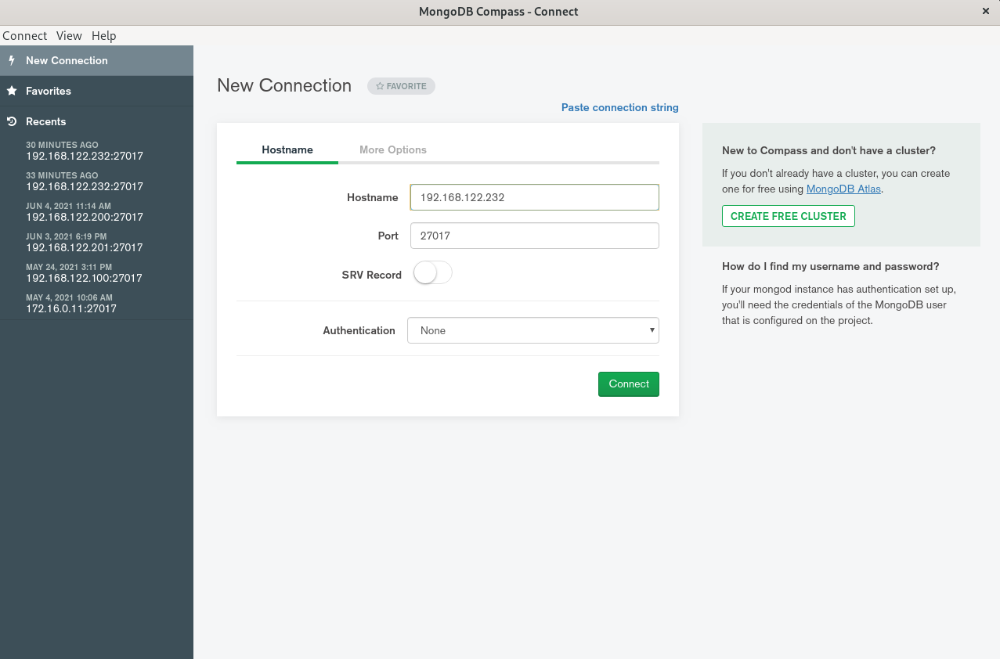
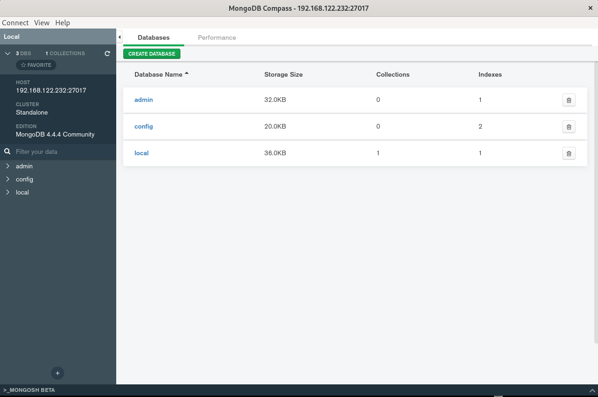

# Mongo Training

## Install VM


* OS : [Fedora 34 Server ](https://download.fedoraproject.org/pub/fedora/linux/releases/34/Server/x86_64/iso/Fedora-Server-dvd-x86_64-34-1.2.iso)
* Cpu: 2 sockets
* Ram: 2048 MB
* Disk: 20 GB \(LVM\)
* Network: NAT & Bridge

#### **Disk**



#### Network



#### Settings



#### Finished



### Keyboard & SSH &  Repo  & FireWall Ayarları

#### Keyboard:

```bash
   localectl set-keymap tr
```

#### SSH:

```bash
vi /etc/ssh/sshd_config
```

```text
#PermitRootLogin prohibit-password
PermitRootLogin Yes
```

#### Repo:

```bash
vi /etc/yum.repos.d/mongodb.repo
```

```text
[mongodb]
name=MongoDB Upstream Repository
baseurl=https://repo.mongodb.org/yum/redhat/8Server/mongodb-org/4.4/x86_64/
gpgcheck=1
enabled=1
gpgkey=https://www.mongodb.org/static/pgp/server-4.4.asc
```

```text
systemctl  restart sshd
```

### Install MongoDB

```text
yum install -y mongodb-org mongodb-org-tools mongodb-org-shell
```

### SELinux and FirewallD

Security-Enhanced Linux 

```text
vi /etc/selinux/config
```

```text
#SELINUX=enforcing
SELINUX=disabled

```

```text
systemctl  stop firewalld.service
systemctl  disable firewalld.service
```

### Start MongoDB 

```text
sudo systemctl enable mongod.service
sudo systemctl start mongod.service
```

```text
[root@fedora ~]# mongod --version
db version v4.4.4
Build Info: {
    "version": "4.4.4",
    "gitVersion": "8db30a63db1a9d84bdcad0c83369623f708e0397",
    "openSSLVersion": "OpenSSL 1.1.1k  FIPS 25 Mar 2021",
    "modules": [],
    "allocator": "tcmalloc",
    "environment": {
        "distmod": "rhel80",
        "distarch": "x86_64",
        "target_arch": "x86_64"
    }
}
```

### Configure

```text
[root@fedora ~]# cat /etc/mongod.conf 
# mongod.conf

# for documentation of all options, see:
#   http://docs.mongodb.org/manual/reference/configuration-options/

# where to write logging data.
systemLog:
  destination: file
  logAppend: true
  path: /var/log/mongodb/mongod.log

# Where and how to store data.
storage:
  dbPath: /var/lib/mongo
  journal:
    enabled: true
#  engine:
#  wiredTiger:

# how the process runs
processManagement:
  fork: true  # fork and run in background
  pidFilePath: /var/run/mongodb/mongod.pid  # location of pidfile
  timeZoneInfo: /usr/share/zoneinfo

# network interfaces
net:
  port: 27017
  bindIp: 0.0.0.0  # Enter 0.0.0.0,:: to bind to all IPv4 and IPv6 addresses or, alternatively, use the net.bindIpAll setting.


#security:

#operationProfiling:

#replication:

#sharding:

## Enterprise-Only Options

#auditLog:

#snmp:

```

```sh
mongod --config /etc/mongod.conf
```

### Mongo Compass








