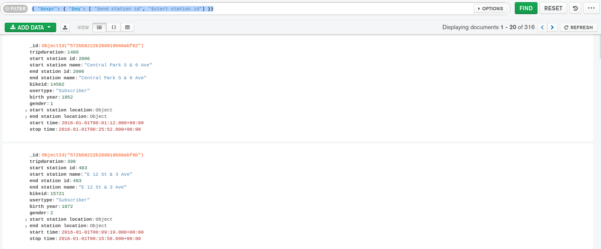

# Expressive Query Operator

Aynı belgedeki alanları karşılaştıran sorgu ifadeleri oluşturmak için kullanılır.

```text
{
    "_id": {
        "$oid": "572bb8222b288919b68abf5a"
    },
    "tripduration": 379,
    "start station id": 476,
    "start station name": "E 31 St & 3 Ave",
    "end station id": 498,
    "end station name": "Broadway & W 32 St",
    "bikeid": 17827,
    "usertype": "Subscriber",
    "birth year": 1969,
    "gender": 1,
    "start station location": {
        "type": "Point",
        "coordinates": [-73.97966069, 40.74394314]
    },
    "end station location": {
        "type": "Point",
        "coordinates": [-73.98808416, 40.74854862]
    },
    "start time": {
        "$date": "2016-01-01T00:00:45.000Z"
    },
    "stop time": {
        "$date": "2016-01-01T00:07:04.000Z"
    }
}
```

sample\_training veritabanının trips collection dan bir document; "$end station id" ve "$start station id" nin eşit olduğu değerleri getirelim.

```text
{ "$expr": { "$eq": [ "$end station id", "$start station id"] }}
```



Yolculuğun 1200 saniyeden uzun sürdüğü ve aynı istasyonda başlayıp bittiği tüm belgeleri bulalım:

```text
db.trips.find({ "$expr": { "$and": [ { "$gt": [ "$tripduration", 1200 ]},
                         { "$eq": [ "$end station id", "$start station id" ]}
                       ]}}).count()
```


