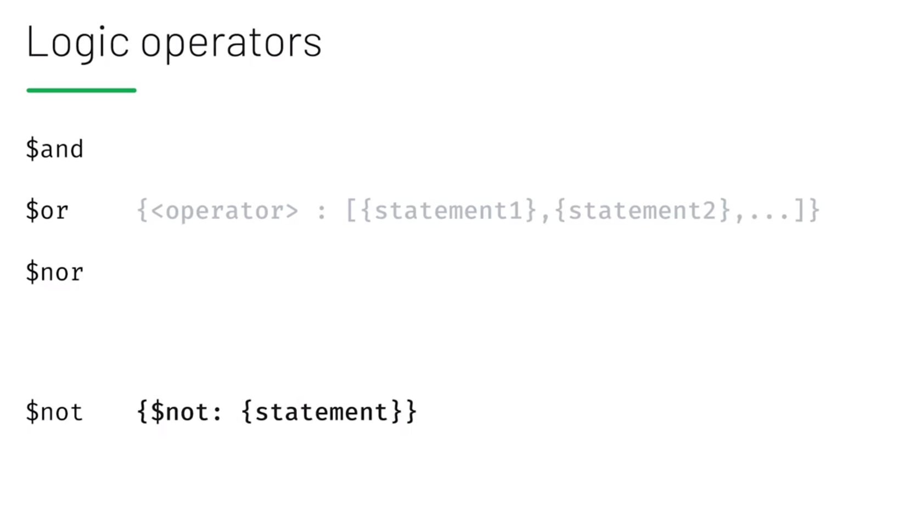
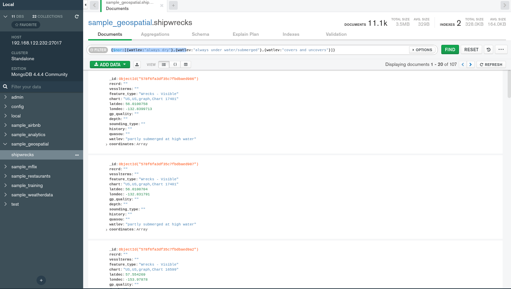
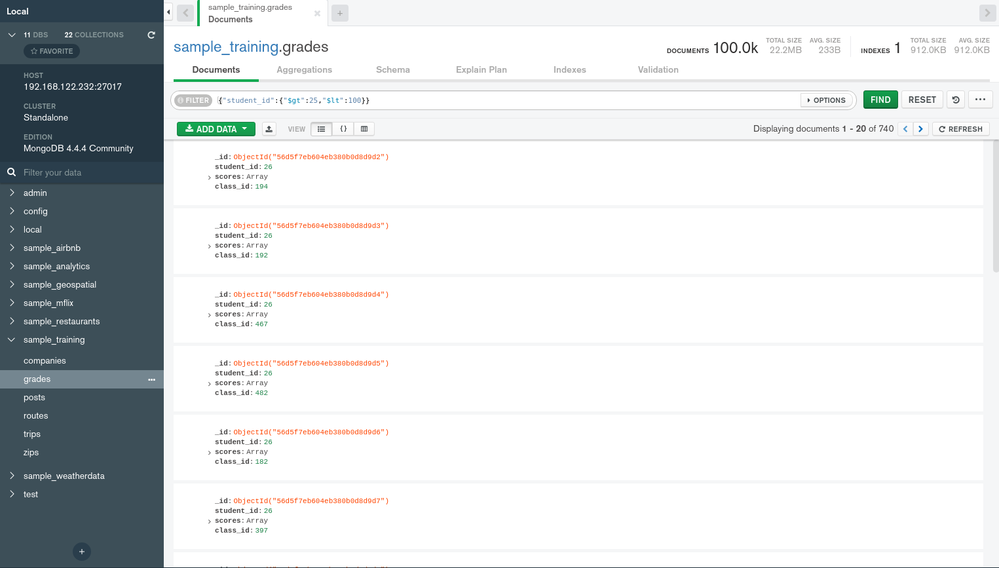

# Logic Operators

| Operatör | Açıklaması |
| :--- | :--- |
| $and | Match all of the specified query clauses |
| $or | At least one of the query clauses is matched |
| $nor | Fail to match both given clauses |
| $not | Negates the query requirement |



### $nor example




{$nor:\[{watlev:"always dry"},{watlev:"always under water/submerged"},{watlev:"covers and uncovers"}\]}


### $and

```text
{"$and":[{"student_id":{"$gt":25}},{"student_id":{"$lt":100}}]}
```

```text
{"student_id":{"$gt":25,"$lt":100}}
```

![{&quot;$and&quot;:\[{&quot;student\_id&quot;:{&quot;$gt&quot;:25}},{&quot;student\_id&quot;:{&quot;$lt&quot;:100}}\]}](.gitbook/assets/and.png)



Varış veya Kalkış  havaalnı KZN kodlu ve Uçak Tipi CR2 veya A81 olan uçuşları bulalım.

```text
use sample_training
db.routes.find({ "$and": [ { "$or" :[ { "dst_airport": "KZN" },
                                    { "src_airport": "KZN" }
                                  ] },
                          { "$or" :[ { "airplane": "CR2" },
                                     { "airplane": "A81" } ] }
                         ]}).pretty()
```

```text
{
	"_id" : ObjectId("56e9b39b732b6122f877fa31"),
	"airline" : {
		"id" : 410,
		"name" : "Aerocondor",
		"alias" : "2B",
		"iata" : "ARD"
	},
	"src_airport" : "CEK",
	"dst_airport" : "KZN",
	"codeshare" : "",
	"stops" : 0,
	"airplane" : "CR2"
}
{
	"_id" : ObjectId("56e9b39b732b6122f877fa32"),
	"airline" : {
		"id" : 410,
		"name" : "Aerocondor",
		"alias" : "2B",
		"iata" : "ARD"
	},
	"src_airport" : "ASF",
	"dst_airport" : "KZN",
	"codeshare" : "",
	"stops" : 0,
	"airplane" : "CR2"
}
{
	"_id" : ObjectId("56e9b39b732b6122f877fa34"),
	"airline" : {
		"id" : 410,
		"name" : "Aerocondor",
		"alias" : "2B",
		"iata" : "ARD"
	},
	"src_airport" : "DME",
	"dst_airport" : "KZN",
	"codeshare" : "",
	"stops" : 0,
	"airplane" : "CR2"
}
{
	"_id" : ObjectId("56e9b39b732b6122f877fa38"),
	"airline" : {
		"id" : 410,
		"name" : "Aerocondor",
		"alias" : "2B",
		"iata" : "ARD"
	},
	"src_airport" : "AER",
	"dst_airport" : "KZN",
	"codeshare" : "",
	"stops" : 0,
	"airplane" : "CR2"
}
{
	"_id" : ObjectId("56e9b39b732b6122f877fa3b"),
	"airline" : {
		"id" : 410,
		"name" : "Aerocondor",
		"alias" : "2B",
		"iata" : "ARD"
	},
	"src_airport" : "EGO",
	"dst_airport" : "KZN",
	"codeshare" : "",
	"stops" : 0,
	"airplane" : "CR2"
}
{
	"_id" : ObjectId("56e9b39b732b6122f877fa3e"),
	"airline" : {
		"id" : 410,
		"name" : "Aerocondor",
		"alias" : "2B",
		"iata" : "ARD"
	},
	"src_airport" : "KZN",
	"dst_airport" : "AER",
	"codeshare" : "",
	"stops" : 0,
	"airplane" : "CR2"
}
{
	"_id" : ObjectId("56e9b39b732b6122f877fa3f"),
	"airline" : {
		"id" : 410,
		"name" : "Aerocondor",
		"alias" : "2B",
		"iata" : "ARD"
	},
	"src_airport" : "KZN",
	"dst_airport" : "ASF",
	"codeshare" : "",
	"stops" : 0,
	"airplane" : "CR2"
}
{
	"_id" : ObjectId("56e9b39b732b6122f877fa40"),
	"airline" : {
		"id" : 410,
		"name" : "Aerocondor",
		"alias" : "2B",
		"iata" : "ARD"
	},
	"src_airport" : "KZN",
	"dst_airport" : "CEK",
	"codeshare" : "",
	"stops" : 0,
	"airplane" : "CR2"
}
{
	"_id" : ObjectId("56e9b39b732b6122f877fa41"),
	"airline" : {
		"id" : 410,
		"name" : "Aerocondor",
		"alias" : "2B",
		"iata" : "ARD"
	},
	"src_airport" : "KZN",
	"dst_airport" : "DME",
	"codeshare" : "",
	"stops" : 0,
	"airplane" : "CR2"
}
{
	"_id" : ObjectId("56e9b39b732b6122f877fa42"),
	"airline" : {
		"id" : 410,
		"name" : "Aerocondor",
		"alias" : "2B",
		"iata" : "ARD"
	},
	"src_airport" : "KZN",
	"dst_airport" : "EGO",
	"codeshare" : "",
	"stops" : 0,
	"airplane" : "CR2"
}
{
	"_id" : ObjectId("56e9b39b732b6122f877fa43"),
	"airline" : {
		"id" : 410,
		"name" : "Aerocondor",
		"alias" : "2B",
		"iata" : "ARD"
	},
	"src_airport" : "KZN",
	"dst_airport" : "LED",
	"codeshare" : "",
	"stops" : 0,
	"airplane" : "CR2"
}
{
	"_id" : ObjectId("56e9b39b732b6122f877fa44"),
	"airline" : {
		"id" : 410,
		"name" : "Aerocondor",
		"alias" : "2B",
		"iata" : "ARD"
	},
	"src_airport" : "KZN",
	"dst_airport" : "SVX",
	"codeshare" : "",
	"stops" : 0,
	"airplane" : "CR2"
}
{
	"_id" : ObjectId("56e9b39b732b6122f877fa45"),
	"airline" : {
		"id" : 410,
		"name" : "Aerocondor",
		"alias" : "2B",
		"iata" : "ARD"
	},
	"src_airport" : "LED",
	"dst_airport" : "KZN",
	"codeshare" : "",
	"stops" : 0,
	"airplane" : "CR2"
}
{
	"_id" : ObjectId("56e9b39b732b6122f877fa52"),
	"airline" : {
		"id" : 410,
		"name" : "Aerocondor",
		"alias" : "2B",
		"iata" : "ARD"
	},
	"src_airport" : "SVX",
	"dst_airport" : "KZN",
	"codeshare" : "",
	"stops" : 0,
	"airplane" : "CR2"
}
{
	"_id" : ObjectId("56e9b39c732b6122f87868bc"),
	"airline" : {
		"id" : 641,
		"name" : "Rossiya-Russian Airlines",
		"alias" : "FV",
		"iata" : "SDM"
	},
	"src_airport" : "KZN",
	"dst_airport" : "LED",
	"codeshare" : "",
	"stops" : 0,
	"airplane" : "A81"
}
{
	"_id" : ObjectId("56e9b39c732b6122f87868be"),
	"airline" : {
		"id" : 641,
		"name" : "Rossiya-Russian Airlines",
		"alias" : "FV",
		"iata" : "SDM"
	},
	"src_airport" : "LED",
	"dst_airport" : "KZN",
	"codeshare" : "",
	"stops" : 0,
	"airplane" : "A81"
}
{
	"_id" : ObjectId("56e9b39c732b6122f878c0f9"),
	"airline" : {
		"id" : 130,
		"name" : "Aeroflot Russian Airlines",
		"alias" : "SU",
		"iata" : "AFL"
	},
	"src_airport" : "KZN",
	"dst_airport" : "LED",
	"codeshare" : "",
	"stops" : 0,
	"airplane" : "A81"
}
{
	"_id" : ObjectId("56e9b39c732b6122f878c120"),
	"airline" : {
		"id" : 130,
		"name" : "Aeroflot Russian Airlines",
		"alias" : "SU",
		"iata" : "AFL"
	},
	"src_airport" : "LED",
	"dst_airport" : "KZN",
	"codeshare" : "",
	"stops" : 0,
	"airplane" : "A81"
}
```


