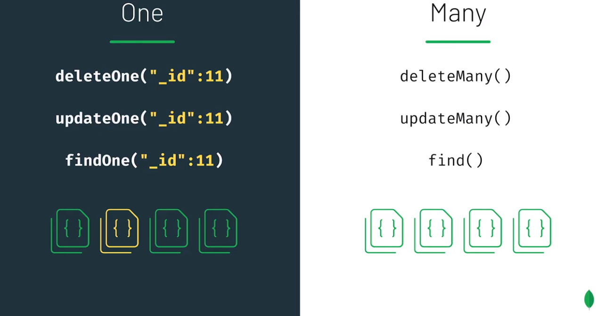

# Mongo Shell - Delete

Belge silme, hem güncelleme hem de sorgulama işlemleriyle ortak özelliklere sahiptir.




### deleteMany


Does removing all collections in a database also remove the database?


```text
use sample_training
db.inspections.find({"date":"Feb 20 2015"}).count()
>320
```

```text
db.inspections.deleteMany({"date":"Feb 20 2015"})
{ "acknowledged" : true, "deletedCount" : 320 }
```

### deleteOne

```text
db.inspections.findOne()
{
	"_id" : ObjectId("56d61033a378eccde8a83550"),
	"id" : "10057-2015-ENFO",
	"certificate_number" : 6007104,
	"business_name" : "LD BUSINESS SOLUTIONS",
	"date" : "Feb 25 2015",
	"result" : "Violation Issued",
	"sector" : "Tax Preparers - 891",
	"address" : {
		"city" : "NEW YORK",
		"zip" : 10030,
		"street" : "FREDERICK DOUGLASS BLVD",
		"number" : 2655
	}
}
> 
```

```text
db.inspections.deleteOne({"_id" : ObjectId("56d61033a378eccde8a83550")})
{ "acknowledged" : true, "deletedCount" : 1 }
```

### drop

```text
> show collections
companies
grades
inspections
posts
routes
trips
zips
> db.inspection.drop()
false
> db.inspections.drop()
true
> show collections
companies
grades
posts
routes
trips
zips
```

## How to Remove a Field from a MongoDB Document 

```text
db.zips.findOne()
{
	"_id" : ObjectId("5c8eccc1caa187d17ca6ed16"),
	"city" : "ALPINE",
	"zip" : "35014",
	"loc" : {
		"y" : 33.331165,
		"x" : 86.208934
	},
	"pop" : 3062,
	"state" : "AL"
}
> 
```

#### delete pop field

```text

```

