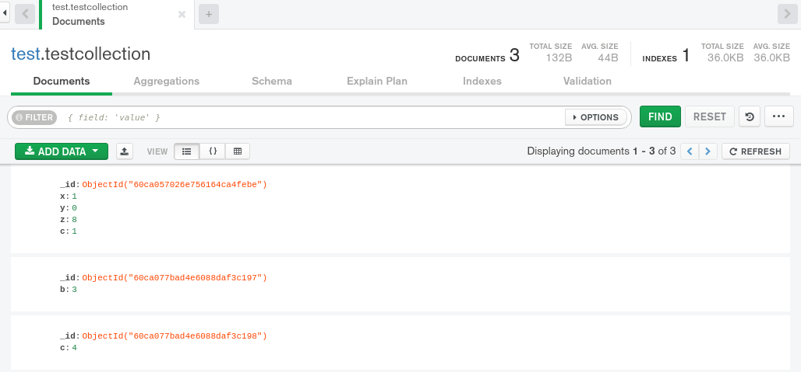
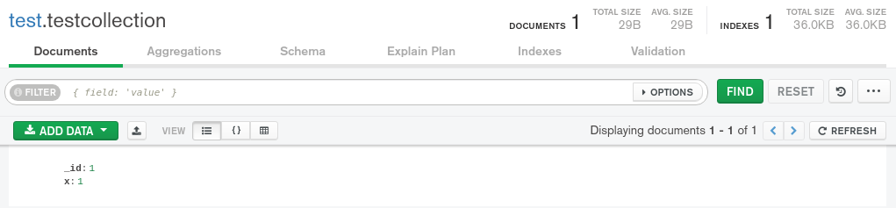
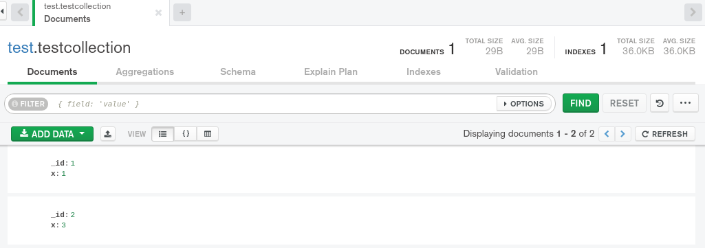

# Mongo Shell - Insert

 

| insert\(\) | insertOne\(\) | insertMany\(\) |
| :--- | :--- | :--- |
| db.collection.insert\(\)  bir belgeyi veya belgeleri bir koleksiyona ekler ve tekli ekler için bir WriteResult nesnesi ve toplu ekler için bir BulkWriteResult nesnesi döndürür. | db.collection.insertOne\(\) bir koleksiyona bir belge ekler ve  bir belge döndürür. | db.collection.insertMany\(\) bir koleksiyona birden çok belge ekler ve  bir belge döndürür. |

### insert

```text
use test
> var test1 = db.testcollection.insert({"x":1,"y":0,"z":8,"c":1})
> test1
WriteResult({ "nInserted" : 1 })

```

```text
> var test2=db.testcollection.insert([{"b": 3}, {'c': 4}])
> test2
BulkWriteResult({
	"writeErrors" : [ ],
	"writeConcernErrors" : [ ],
	"nInserted" : 2,
	"nUpserted" : 0,
	"nMatched" : 0,
	"nModified" : 0,
	"nRemoved" : 0,
	"upserted" : [ ]
})

```



### insertOne\(\)

```text
> var test3 = db.testcollection.insertOne({"a": 3})
> test3
{
	"acknowledged" : true,
	"insertedId" : ObjectId("60ca0c22ad4e6088daf3c19c")
}
```

### insertMany\(\)

```text
> var test4 = db.testcollection.insertMany([{"b": 3}, {'c': 4}])
> test4
{
	"acknowledged" : true,
	"insertedIds" : [
		ObjectId("60ca0d9dad4e6088daf3c19f"),
		ObjectId("60ca0d9dad4e6088daf3c1a0")
	]
}

```

### insert & Error

```text
mongorestore --db sample_weatherdata sample_weatherdata/sample_weatherdata/ 
```

```text
2021-06-1T17:55:54.225+0300	continuing through error: 
2021-06-1T17:55:54.225+0300	no indexes to restore
2021-06-1T17:55:54.225+0300	finished restoring sample_weatherdata.data (0 documents, 10000 failures)
2021-06-1T17:55:54.225+0300	0 document(s) restored successfully. 10000 document(s) failed to restore
```


continuing through error: E11000 duplicate key error collection: sample_weatherdata.data index: \_id_ dup key: { \_id: ObjectId\('5553a99ae4b02cf715120faf'\) }


#### Drop

```text
mongorestore  --drop --db sample_weatherdata sample_weatherdata/sample_weatherdata/
```

#### Ordered

```text
use test
db.testcollection.insert([{"_id":1 ,"x":1},{"_id":1,"x":2},{"_id":2,"x":3}])

>BulkWriteResult({
	"writeErrors" : [
		{
			"index" : 1,
			"code" : 11000,
			"errmsg" : "E11000 duplicate key error collection: test.testcollection index: _id_ dup key: { _id: 1.0 }",
			"op" : {
				"_id" : 1,
				"x" : 2
			}
		}
	],
	"writeConcernErrors" : [ ],
	"nInserted" : 1,
	"nUpserted" : 0,
	"nMatched" : 0,
	"nModified" : 0,
	"nRemoved" : 0,
	"upserted" : [ ]


```



```text
db.testcollection.insert([{"_id":1 ,"x":1},{"_id":1,"x":2},{"_id":2,"x":3}],{"ordered":false})
>
BulkWriteResult({
	"writeErrors" : [
		{
			"index" : 0,
			"code" : 11000,
			"errmsg" : "E11000 duplicate key error collection: test.testcollection index: _id_ dup key: { _id: 1.0 }",
			"op" : {
				"_id" : 1,
				"x" : 1
			}
		},
		{
			"index" : 1,
			"code" : 11000,
			"errmsg" : "E11000 duplicate key error collection: test.testcollection index: _id_ dup key: { _id: 1.0 }",
			"op" : {
				"_id" : 1,
				"x" : 2
			}
		}
	],
	"writeConcernErrors" : [ ],
	"nInserted" : 1,
	"nUpserted" : 0,
	"nMatched" : 0,
	"nModified" : 0,
	"nRemoved" : 0,
	"upserted" : [ ]

```



MongoDB nin sıralı mı yoksa sırasız bir ekleme mi gerçekleştireceğini belirten bir boole değeri . Varsayılan olarak `true`.

