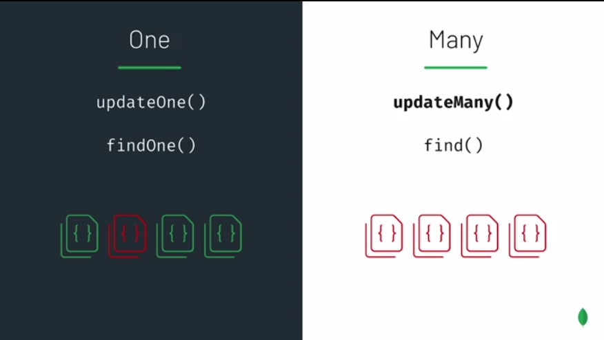

# Mongo Shell - Update



```text
use sample_training
db.zips.find({ "zip": "12534" }).pretty()
```

```text
{
	"_id" : ObjectId("5c8eccc1caa187d17ca73239"),
	"city" : "HUDSON",
	"zip" : "12534",
	"loc" : {
		"y" : 42.246978,
		"x" : 73.755248
	},
	"pop" : 21205,
	"state" : "NY"
}

```

#### $INC

Bu Operatör pozitif ve negatif değerleri kabul eder. Alan yoksa, alanı  oluşturur ve alanı belirtilen değere ayarlar.

#### city _field equal to_ "HUDSON".

```text
db.zips.find({ "city": "HUDSON" }).count()
>16
```

#### _adding_ 10 _to the current value of the_ "pop" _field._

```text
db.zips.updateMany({ "city": "HUDSON" }, { "$inc": { "pop": 10 } })
```

```text
{ "acknowledged" : true, "matchedCount" : 16, "modifiedCount" : 16 }
```

#### $SET

Bu Operatör belirli bir değere sahip bir alanın değerini değiştirir.

```text
> db.zips.find({ "zip": "12534" }).pretty()
{
	"_id" : ObjectId("5c8eccc1caa187d17ca73239"),
	"city" : "HUDSON",
	"zip" : "12534",
	"loc" : {
		"y" : 42.246978,
		"x" : 73.755248
	},
	"pop" : 21215,
	"state" : "NY"
}

```

#### _setting the value of the_ "pop" _field to_ 1081.

```text
>db.zips.updateOne({ "zip": "12534" }, { "$set": { "pop": 1081} })
{ "acknowledged" : true, "matchedCount" : 1, "modifiedCount" : 1 }
```

#### $PUSH

$push operatörü, bir diziye belirli bir değer ekler.

```text
db.grades.find({ "student_id": 250, "class_id": 339 }).pretty()
```

```text
{
	"_id" : ObjectId("56d5f7eb604eb380b0d8e292"),
	"student_id" : 250,
	"scores" : [
		{
			"type" : "exam",
			"score" : 3.6641013617826124
		},
		{
			"type" : "quiz",
			"score" : 16.099760154050923
		},
		{
			"type" : "homework",
			"score" : 18.069138737846245
		},
		{
			"type" : "homework",
			"score" : 66.16407292421133
		}
	],
	"class_id" : 339
}
```

```text
db.grades.updateOne({ "student_id": 250, "class_id": 339 },
                    { "$push": { "scores": { "type": "extra credit",
                                             "score": 100 }
                                }
                     })
 >{ "acknowledged" : true, "matchedCount" : 1, "modifiedCount" : 1 }
```

```text
{
	"_id" : ObjectId("56d5f7eb604eb380b0d8e292"),
	"student_id" : 250,
	"scores" : [
		{
			"type" : "exam",
			"score" : 3.6641013617826124
		},
		{
			"type" : "quiz",
			"score" : 16.099760154050923
		},
		{
			"type" : "homework",
			"score" : 18.069138737846245
		},
		{
			"type" : "homework",
			"score" : 66.16407292421133
		},
		{
			"type" : "extra credit",
			"score" : 100
		}
	],
	"class_id" : 339
}
```


